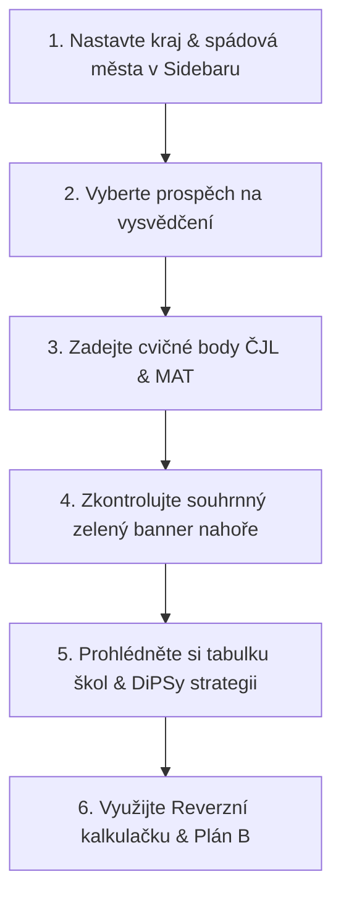

# 📖 Cermat Asistent – „Blbovzdorný" průvodce pro rodiče a žáky

> **Jak snadno používat aplikaci a vytěžit z ní maximum během celého školního roku.**

---

## 🧭 1. Rychlý návod krok za krokem

### Krok 1: Nastavte filtry v levém panelu (Sidebar)
1. **Kraj:** Vyberte váš kraj (např. *Středočeský kraj*).
2. **Typ školy:** Vyberte *Gymnázium 4leté*, *SOŠ* nebo nechte *Všechny*.
3. **Preferovaná města / spádová oblast:** Vyberte města v dojezdové vzdálenosti *(např. Kutná Hora, Kolín, Čáslav)*.
   > 💡 Školy v těchto městech budou v aplikaci označené **hvězdičkou ⭐** a posunou se na přední místa v přehledu!

### Krok 2: Zadejte své výsledky z cvičných testů
- Můžete využít **⚡ Rychlé předvolby bodů** na 1 klik:
  - `55 b.` (Průměrný žák: 30 ČJL / 25 MAT)
  - `80 b.` (Jedničkář: 42 ČJL / 38 MAT)
  - `92 b.` (Gymnázium: 47 ČJL / 45 MAT)
- Nebo ručně nastavte přesné body ze slidery ČJL a MAT (0–50 bodů).
- V sekci **Školní prospěch** zvolte váš průměr známek z 8. a 9. třídy ZŠ.

### Krok 3: Podívejte se na zelenou kartu v záhlaví
Ihned nad tabulkou uvidíte souhrn pro váš profil:
> `✨ Souhrn pro váš profil (65 b. / 78.4. percentil): 🟢 8 škol v pásmu Jistoty | 🟡 5 škol s Reálnou šancí | 🔴 2 školy v Riziku`

---

## 💡 2. Jak rozumět jednotlivým sekcím v aplikaci

### 📊 Sekce 1: Přehled vyhodnocených škol
Tabulka vyhodnocuje vaše šance u všech dostupných škol v kraji. Šance jsou rozděleny do 3 barevných kategorií:

- 🟢 **Vysoká (Jistota):** Váš percentil je bezpečně nad odhadovanou hranicí školy. Pokud nepředvedete výrazný výpadek, na školu se dostanete.
- 🟡 **Střední (Reálná):** Jste v pásmu nejistoty. Šance je solidní, ale rozhodne vaše aktuální forma v den zkoušky.
- 🔴 **Nízká (Riziková):** Váš percentil nedosahuje na spodní hranici odhadovaného pásma školy.

---

### 🎯 Sekce 2: Doporučená DiPSy strategie (1.–3. priorita)
V novém elektronickém systému DiPSy **neexistuje penalizace za uvedení náročné školy na 1. místě**!

Systém vám automaticky doporučí ideální poskládání 3 přihlášek:
1. 🎯 **1. Priorita (Vysněná):** Škola s vyššími nároky (šance např. 30–60 %). Pokud vám testy v den Z sednou, máte šanci se tam dostat.
2. ⚖️ **2. Priorita (Reálná):** Škola plně odpovídající vaší běžné výkonnosti (šance 60–85 %).
3. 🛡️ **3. Priorita (Jistota):** Záchranná síť s nižším přetlakem pro případ nepovedeného testu (šance > 85 %).

---

### 🎯 Sekce 4: Reverzní kalkulačka – Kolik bodů potřebuji?
Vyberte si konkrétní cílovou školu a kalkulačka vám spočítá přesný bodový cíl:
- **Vyvážený styl:** Cílové body vyrovnaně z ČJL i MAT.
- **Kompenzační styl:** Zadáte vaše silnější ČJL *(např. 42 bodů)* a kalkulačka dopočítá, kolik **nejméně** musíte získat z matematiky pro dosažení potřebné hranice!

---

### 💡 Sekce 5: Plán B (Spádové alternativy)
Pokud máte u své vysněné školy **🔴 Nízkou (Rizikovou) šanci**, systém automaticky prohledá databázi ve vašem kraji a najde **příbuzné obory podle KKOV** ve vašich preferovaných městech s nižší bodovou náročností.

*Příklad:* Umělecké gymnázium → Kombinované nebo Ekonomické lyceum v Kolíně.

---

### 🔄 Sekce 6: Co kdyby… (Scénáře)
Zadejte si dva různé bodové výkony (např. *Scénář A: slabší den -5 b.* vs. *Scénář B: silnější den +5 b.*). Srovnávací tabulka vám hned ukáže:
- **✅ Zlepšení** – Školy, u kterých se šance při lepším dni posune na Jistotu.
- **⬇️ Zhoršení** – Školy, kde by horší den znamenal riziko.
- **Beze změny** – Školy, kde máte bezpečnou rezervu v obou případech.

---

### ⏪ Sekce 7: Backtest („Přijali by mě loni?")
Porovnejte své aktuální cvičné body se **skutečnými minimálními percentily** v letech 2024, 2025 nebo 2026.
- Žádná predikce – čistá historická fakta.
- Hned uvidíte: *„S mými 65 body bych v roce 2025 byl přijat na 12 ze 14 škol (86 % úspěšnost)."*

---

### 🏫 Sekce 8: Detailní karta školy
Vyberte libovolnou školu a zobrazte si její kompletní kartu:
- Všechny vyučované obory dané školy (ne jen ten 1 vyfiltrovaný).
- Historický vývoj kapacit a počtů přihlášek.
- Interaktivní graf srovnání náročnosti jednotlivých oborů na stejné škole.

---

## 💾 Jak si uložit profil na příště?

1. V levém panelu rozbalte `💾 Správa profilu (Uložit / Načíst)`.
2. Klikněte na **`💾 Uložit profil`** – stáhne se vám malý soubor `cermat_profil.json`.
3. Až se za měsíc k aplikaci vrátíte s novými výsledky cvičných testů, stačí v téže sekci soubor nahrát přes **`📂 Načíst profil`** a veškeré nastavení se vám vteřinově obnoví!

---

## 📄 Jak vytisknout report pro rodiče nebo poradce?

V sidebaru klikněte na tlačítko **`📄 Stáhnout PDF report`**. Vygeneruje se vám jednostránkový A4 dokument s vaším profilem, DiPSy strategií, tabulkou škol i Plánem B, který si můžete vytisknout na papír nebo poslat e-mailem.

---

## ❓ Často kladené otázky (FAQ)

**Q: Proč v aplikaci pracujeme s percentily místo bodů?**  
*A: Obtížnost testů Cermat se meziročně mění (např. 35 bodů v těžkém ročníku z matematiky odpovídá 90. percentilu, zatímco v lehkém ročníku znamená stejných 35 bodů pouze 75. percentil). Percentil udává procento uchazečů, kteří měli horší nebo stejný výsledek jako vy.*

**Q: Zjišťuje aplikace i školní známky?**  
*A: Ano, v sidebaru zvolte váš průměr známek z 8. a 9. třídy ZŠ. Aplikace upraví váš efektivní percentil o korekci (až ±6 %). Vždy si ale zkontrolujte konkrétní kritéria vybrané SŠ vydávaná ředitelem školy do 31. ledna.*

**Q: Ukládá aplikace moje data na internetu?**  
*A: Ne. Aplikace nevyžaduje žádnou registraci, neukládá žádná osobní data ani nepoužívá sledovací cookies. Vše probíhá 100% anonymně.*
